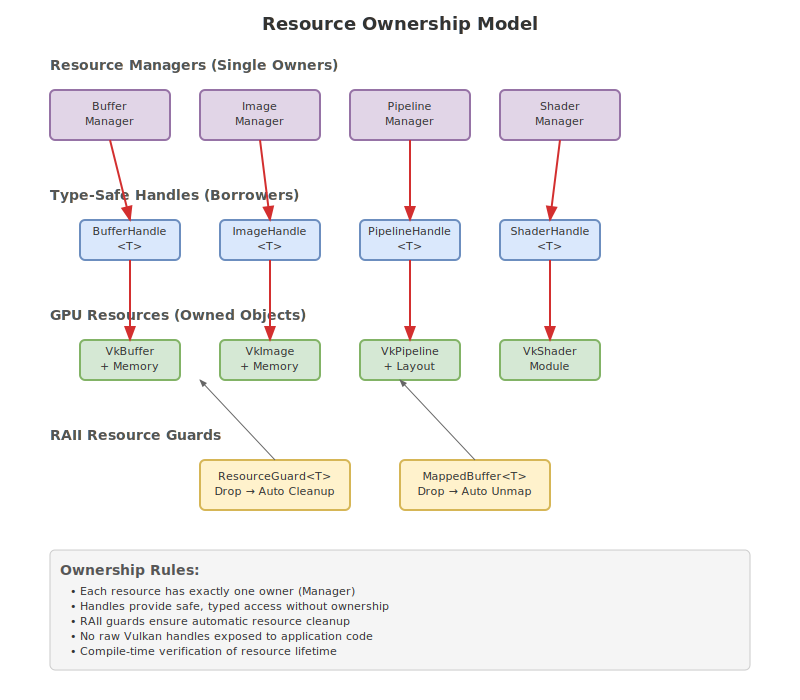
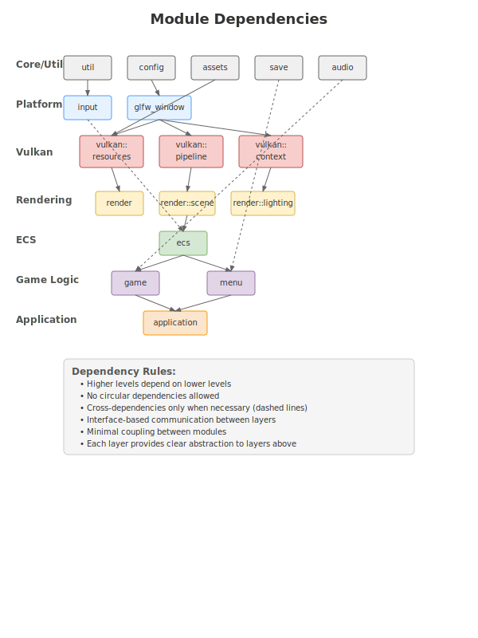

# Rusteroids

A modular ECS-based Asteroids game showcasing a reusable Rust game engine architecture. The project demonstrates clean separation between generic engine components and application-specific game logic.

## Architecture Overview


The project is structured as two distinct layers:
- **RustEngine**: Generic, reusable game engine components
- **Asteroids Game**: Application-specific implementation using the engine

### Key Features

**Engine Layer:**
- High-performance ECS (Entity-Component-System) architecture
- Vulkan-based 3D rendering with 2D support
- Modular asset loading system (models, textures, shaders, audio)
- Cross-platform input handling
- 3D spatial audio system
- Plugin architecture for extensibility
- Memory-safe resource management with RAII patterns

**Application Layer:**
- Classic Asteroids gameplay mechanics
- Game state management (menus, gameplay, scoring)
- Custom UI system
- Persistent settings and high scores
- Game-specific asset pipeline

## Design Documentation

### Core Architecture Documents
- [**Engine Design**](docs/ENGINE_DESIGN.md) - Complete engine architecture specification
- [**Rendering Design**](docs/DESIGN.md) - Vulkan rendering system design
- [**Project Restructure**](docs/PROJECT_RESTRUCTURE.md) - Multi-crate workspace organization

### Architecture Diagrams

#### Resource Ownership Model


Our resource management system follows strict ownership rules:
- Single owner per resource (Managers)
- Type-safe handles for borrowing
- RAII patterns for automatic cleanup
- No raw Vulkan handles exposed

#### Module Dependencies


Clean layered architecture with:
- Clear dependency hierarchy
- No circular dependencies
- Interface-based communication
- Minimal coupling between modules

#### Data Flow Architecture


Unidirectional data flow from game logic to GPU:
- Game Logic → Scene Management → Rendering → Vulkan → GPU
- Error propagation and validation at each layer
- Batched command recording for performance

## Current Project Structure

```
rusteroids/
├── src/                    # Current monolithic structure (to be refactored)
├── resources/              # Game assets
│   ├── shaders/           # GLSL shaders
│   ├── models/            # 3D models
│   ├── textures/          # Texture assets
│   └── audio/             # Sound files
├── docs/                  # Architecture documentation
│   ├── diagrams/          # SVG diagrams
│   ├── ENGINE_DESIGN.md   # Engine architecture
│   ├── DESIGN.md          # Rendering design
│   └── PROJECT_RESTRUCTURE.md
└── target/                # Build output
```

## Planned Structure (Multi-crate Workspace)

The project will be restructured into a multi-crate workspace:

```
rusteroids/
├── crates/
│   ├── rust_engine/       # Generic engine crate
│   ├── asteroids/         # Game application crate
│   └── engine_plugins/    # Optional engine plugins
├── tools/                 # Development tools
├── resources/             # Assets (engine + game)
└── docs/                  # All documentation
```

## Getting Started

### Prerequisites
- Rust 1.70+ with Cargo
- Vulkan SDK installed
- Compatible GPU with Vulkan support

### Building and Running
```bash
# Build the project
cargo build

# Run the game
cargo run

# Run with debug features
cargo run --features debug

# Clean build artifacts
cargo clean

# Run tests
cargo test
```

### Development Setup
```bash
# Install additional tools for development
cargo install cargo-watch
cargo install cargo-flamegraph

# Run with auto-reload during development
cargo watch -x run

# Profile performance
cargo flamegraph --bin rusteroids
```

## Development Status

### ✅ Completed
- [x] Comprehensive architecture design documents
- [x] Vulkan rendering pipeline foundation
- [x] Resource management system design
- [x] ECS framework specification
- [x] Multi-crate workspace planning

### 🚧 In Progress
- [ ] Engine-application separation implementation
- [ ] Basic ECS framework
- [ ] Vulkan renderer refactoring
- [ ] Asset system implementation

### 📋 Planned
- [ ] Asteroids game implementation
- [ ] Plugin system
- [ ] Audio integration
- [ ] Performance optimization
- [ ] Documentation completion

## Architecture Principles

1. **Separation of Concerns**: Engine provides generic functionality, application implements game-specific logic
2. **Zero-Cost Abstractions**: Engine abstractions impose no runtime overhead
3. **Memory Safety**: All resources managed through RAII and Rust's ownership system
4. **Performance First**: Designed for real-time gaming performance requirements
5. **Modularity**: Each subsystem can be used independently
6. **Testability**: Clean interfaces enable comprehensive testing

## Contributing

See [CONTRIBUTING.md](docs/CONTRIBUTING.md) for development guidelines, coding standards, and contribution workflow.

## Performance Goals

- **60 FPS** stable frame rate on target hardware
- **Sub-1ms** frame time variance
- **Minimal memory allocation** during gameplay
- **Efficient GPU utilization** through command batching
- **Scalable architecture** supporting complex scenes

## License

This project is licensed under the MIT License - see the [LICENSE](LICENSE) file for details.
