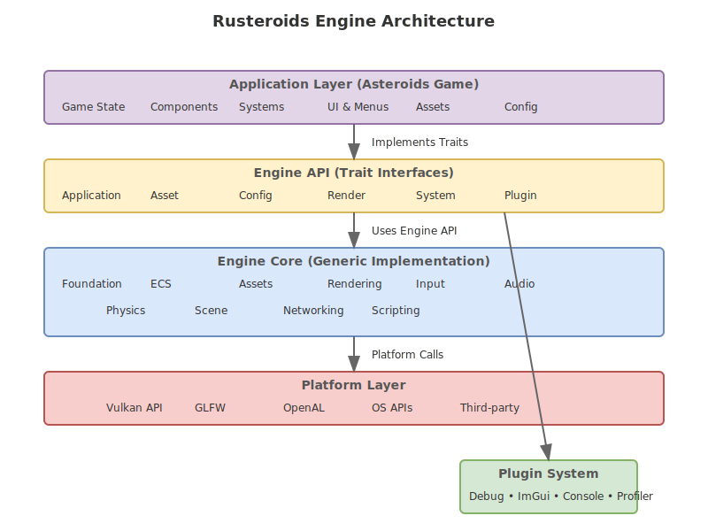
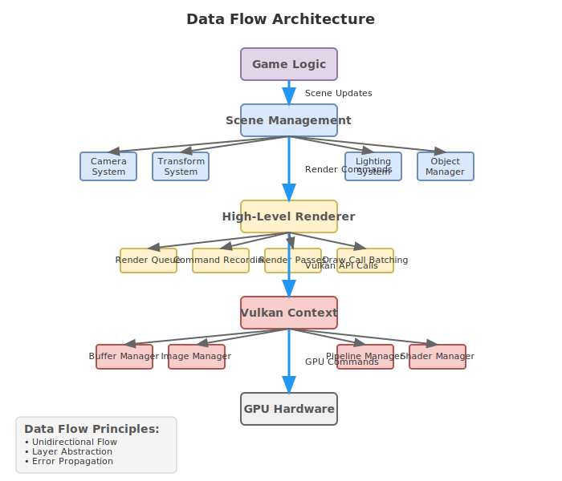

# Rusteroids Engine Architecture Design

## Executive Summary

This document outlines the architectural design for splitting the Rusteroids project into two distinct layers:
1. **Generic Engine (RustEngine)** - Reusable game engine components
2. **Application Layer (Asteroids Game)** - Game-specific implementation

This separation enables code reuse, cleaner architecture, and better maintainability while following Rust's ownership principles and modular design patterns.

## Table of Contents

1. [Architecture Overview](#architecture-overview)
2. [Engine Layer Design](#engine-layer-design)
3. [Application Layer Design](#application-layer-design)
4. [Interface Contracts](#interface-contracts)
5. [Asset Pipeline](#asset-pipeline)
6. [Configuration System](#configuration-system)
7. [Plugin Architecture](#plugin-architecture)
8. [Error Handling Strategy](#error-handling-strategy)
9. [Performance Considerations](#performance-considerations)
10. [Testing Strategy](#testing-strategy)
11. [Implementation Phases](#implementation-phases)

## Architecture Overview

### Core Principles

1. **Separation of Concerns**: Engine provides generic functionality, application implements game-specific logic
2. **Trait-Based Design**: Use traits to define contracts between engine and application
3. **Zero-Cost Abstractions**: Engine abstractions should not impose runtime overhead
4. **Modular Architecture**: Each subsystem can be used independently
5. **Resource Safety**: All resources managed through RAII and ownership rules
6. **Performance First**: Engine designed for real-time performance requirements

### Layer Hierarchy



```
┌─────────────────────────────────────────┐
│           Application Layer             │
│         (Asteroids Game)                │
├─────────────────────────────────────────┤
│              Engine API                 │
│          (Trait Interfaces)             │
├─────────────────────────────────────────┤
│            Engine Core                  │
│      (Generic Implementation)           │
├─────────────────────────────────────────┤
│          Platform Layer                 │
│       (Vulkan, GLFW, etc.)             │
└─────────────────────────────────────────┘
```

The architecture follows a strict layered approach where each layer provides services to the layer above it, ensuring clean separation of concerns and maintainable code.

## Engine Layer Design

### Core Engine Architecture

The engine consists of several independent but cooperating subsystems:

#### 1. Foundation Layer (`engine::foundation`)

**Purpose**: Fundamental utilities and types used throughout the engine.

**Components**:
- **Math Library**: Vectors, matrices, quaternions, transforms
- **Collections**: Optimized data structures (pools, free lists, etc.)
- **Memory Management**: Custom allocators, memory pools
- **Logging**: Structured logging with multiple backends
- **Profiling**: Performance measurement and reporting
- **Threading**: Job system, async tasks, work stealing
- **Time**: High-precision timing, delta time management

**Key Types**:
```rust
// Math primitives
pub struct Vec3 { pub x: f32, pub y: f32, pub z: f32 }
pub struct Transform { pub position: Vec3, pub rotation: Quat, pub scale: Vec3 }

// Memory management
pub trait Allocator { fn allocate(&self, size: usize) -> Result<*mut u8, AllocError>; }
pub struct PoolAllocator<T> { /* ... */ }

// Threading
pub struct JobSystem { /* ... */ }
pub trait Job: Send + Sync { fn execute(&self); }
```

#### 2. Asset System (`engine::assets`)

**Purpose**: Generic asset loading, caching, and management.

**Components**:
- **Asset Registry**: Type-safe asset handles and metadata
- **Loaders**: Extensible loading system for different asset types
- **Cache**: Memory and disk caching with LRU eviction
- **Streaming**: Async asset loading and streaming
- **Hot Reload**: Development-time asset reloading
- **Compression**: Asset compression and decompression

**Key Traits**:
```rust
pub trait Asset: 'static + Send + Sync {
    type LoadData: Send + Sync;
    fn load(data: Self::LoadData) -> Result<Self, AssetError> where Self: Sized;
}

pub trait AssetLoader: Send + Sync {
    type Asset: Asset;
    fn extensions(&self) -> &[&str];
    fn load(&self, bytes: &[u8]) -> Result<Self::Asset, AssetError>;
}

pub struct AssetHandle<T: Asset> {
    id: AssetId,
    _phantom: PhantomData<T>,
}
```

#### 3. ECS Framework (`engine::ecs`)

**Purpose**: High-performance Entity-Component-System architecture.

**Components**:
- **World**: Container for all entities, components, and resources
- **Entity Manager**: Entity creation, deletion, and queries
- **Component Storage**: Optimized storage for different component patterns
- **System Scheduler**: Parallel system execution with dependency resolution
- **Query Interface**: Type-safe component queries
- **Events**: Decoupled event system

**Key Types**:
```rust
pub struct World { /* ... */ }
pub struct Entity(u32);

pub trait Component: 'static + Send + Sync {}

pub trait System {
    type SystemData;
    fn run(&mut self, data: Self::SystemData);
}

pub struct Query<'a, T> { /* ... */ }
```

#### 4. Rendering Framework (`engine::render`)

**Purpose**: Hardware-abstracted rendering system (detailed in DESIGN.md).

**Components**:
- **Render Context**: Hardware abstraction layer
- **Resource Management**: Buffers, textures, pipelines
- **Scene Graph**: Hierarchical scene representation
- **Renderer**: High-level rendering interface
- **Materials**: Shader and material system
- **Lighting**: Lighting model abstractions

#### 5. Input System (`engine::input`)

**Purpose**: Cross-platform input handling and mapping.

**Components**:
- **Input Manager**: Raw input event processing
- **Action Maps**: Logical input mappings
- **Input State**: Current and previous input states
- **Gestures**: Complex input pattern recognition

**Key Types**:
```rust
pub enum InputEvent {
    KeyPressed(KeyCode),
    KeyReleased(KeyCode),
    MouseMoved { x: f32, y: f32 },
    MouseButton { button: MouseButton, pressed: bool },
}

pub trait InputHandler {
    fn handle_input(&mut self, event: InputEvent);
}
```

#### 6. Audio System (`engine::audio`)

**Purpose**: 3D spatial audio and music playback.

**Components**:
- **Audio Context**: Audio device management
- **Sound Sources**: 3D positioned audio sources
- **Audio Mixer**: Multi-channel audio mixing
- **Streaming**: Large audio file streaming
- **Effects**: Audio processing effects

#### 7. Physics Integration (`engine::physics`)

**Purpose**: Physics simulation interface (optional component).

**Components**:
- **Physics World**: Physics simulation container
- **Collision Detection**: Broad and narrow phase collision
- **Rigid Bodies**: Physics body management
- **Constraints**: Physics constraints and joints

### Engine Configuration

The engine uses a trait-based configuration system:

```rust
pub trait EngineConfig {
    type Renderer: RenderConfig;
    type Audio: AudioConfig;
    type Input: InputConfig;
    
    fn window_config(&self) -> WindowConfig;
    fn renderer_config(&self) -> Self::Renderer;
    fn audio_config(&self) -> Self::Audio;
    fn input_config(&self) -> Self::Input;
}
```

### Engine Initialization

```rust
pub struct Engine<Config: EngineConfig> {
    world: World,
    renderer: Box<dyn Renderer>,
    audio: Box<dyn AudioSystem>,
    input: InputManager,
    assets: AssetManager,
}

impl<Config: EngineConfig> Engine<Config> {
    pub fn new(config: Config) -> Result<Self, EngineError> {
        // Initialize all subsystems
    }
    
    pub fn run<App: Application>(mut self, mut app: App) -> Result<(), EngineError> {
        // Main game loop
    }
}
```

## Application Layer Design

### Application Interface

The application implements the `Application` trait to integrate with the engine:

```rust
pub trait Application {
    type Config: EngineConfig;
    
    fn initialize(&mut self, engine: &mut Engine<Self::Config>) -> Result<(), AppError>;
    fn update(&mut self, engine: &mut Engine<Self::Config>, delta_time: f32) -> Result<(), AppError>;
    fn render(&mut self, engine: &mut Engine<Self::Config>) -> Result<(), AppError>;
    fn cleanup(&mut self, engine: &mut Engine<Self::Config>);
}
```

### Asteroids Game Structure

#### Game State Management

```rust
pub enum GameState {
    MainMenu,
    Playing,
    Paused,
    GameOver,
    HighScores,
}

pub struct AsteroidsApp {
    state: GameState,
    game_world: GameWorld,
    ui_system: UISystem,
    score: u32,
    lives: u32,
}
```

#### Game-Specific Components

```rust
// Asteroids-specific components
#[derive(Component)]
pub struct Player {
    pub thrust: f32,
    pub rotation_speed: f32,
    pub max_speed: f32,
}

#[derive(Component)]
pub struct Asteroid {
    pub size: AsteroidSize,
    pub rotation_speed: f32,
}

#[derive(Component)]
pub struct Bullet {
    pub lifetime: f32,
    pub damage: f32,
}

#[derive(Component)]
pub struct Velocity {
    pub linear: Vec3,
    pub angular: f32,
}
```

#### Game-Specific Systems

```rust
pub struct PlayerControlSystem;
impl System for PlayerControlSystem {
    type SystemData = (
        WriteStorage<Player>,
        WriteStorage<Transform>,
        WriteStorage<Velocity>,
        Read<InputState>,
    );
    
    fn run(&mut self, (mut players, mut transforms, mut velocities, input): Self::SystemData) {
        // Player control logic
    }
}

pub struct AsteroidSpawnSystem;
pub struct CollisionSystem;
pub struct BulletSystem;
pub struct ScoreSystem;
```

## Interface Contracts

### Engine-Application Interface

The engine and application communicate through well-defined traits:

#### 1. Application Lifecycle

```rust
pub trait Application {
    fn initialize(&mut self, engine: &mut Engine) -> Result<(), AppError>;
    fn update(&mut self, engine: &mut Engine, dt: f32) -> Result<(), AppError>;
    fn render(&mut self, engine: &mut Engine) -> Result<(), AppError>;
    fn handle_event(&mut self, engine: &mut Engine, event: Event) -> Result<(), AppError>;
    fn cleanup(&mut self, engine: &mut Engine);
}
```

#### 2. Asset Loading

```rust
// Application defines custom asset types
#[derive(Asset)]
pub struct AsteroidModel {
    pub mesh: Handle<Mesh>,
    pub material: Handle<Material>,
}

// Engine provides loading infrastructure
impl AssetLoader for AsteroidModelLoader {
    type Asset = AsteroidModel;
    
    fn load(&self, bytes: &[u8]) -> Result<AsteroidModel, AssetError> {
        // Load asteroid-specific model format
    }
}
```

#### 3. Configuration

```rust
pub struct AsteroidsConfig {
    pub window: WindowConfig,
    pub renderer: VulkanConfig,
    pub audio: AudioConfig,
    pub gameplay: GameplayConfig,
}

impl EngineConfig for AsteroidsConfig {
    type Renderer = VulkanConfig;
    
    fn window_config(&self) -> WindowConfig { self.window }
    fn renderer_config(&self) -> VulkanConfig { self.renderer }
}
```

## Asset Pipeline



### Asset Types Hierarchy

```
Assets/
├── Engine Assets (Generic)
│   ├── Meshes (OBJ, GLTF)
│   ├── Textures (PNG, JPG, DDS)
│   ├── Shaders (GLSL, SPIRV)
│   ├── Materials (JSON)
│   └── Audio (WAV, OGG)
└── Game Assets (Asteroids-specific)
    ├── Ships (Custom format)
    ├── Asteroids (Custom format)
    ├── Effects (Particle systems)
    ├── UI (Fonts, layouts)
    └── Audio (Music, SFX)
```

### Asset Processing Pipeline

1. **Raw Assets** → **Processed Assets** → **Runtime Assets**
2. **Validation** → **Optimization** → **Compression**
3. **Dependency Resolution** → **Bundle Creation**

### Asset Handles and References

```rust
// Type-safe asset handles
pub struct AssetHandle<T: Asset> {
    id: AssetId,
    _phantom: PhantomData<T>,
}

// Weak references for optional assets
pub struct WeakAssetHandle<T: Asset> {
    id: AssetId,
    _phantom: PhantomData<T>,
}

// Asset dependencies
pub struct AssetDependency<T: Asset> {
    handle: AssetHandle<T>,
    required: bool,
}
```

## Configuration System

### Hierarchical Configuration

```rust
// Base engine configuration
pub struct EngineConfig {
    pub window: WindowConfig,
    pub renderer: RendererConfig,
    pub audio: AudioConfig,
    pub input: InputConfig,
}

// Application-specific configuration
pub struct GameConfig {
    pub engine: EngineConfig,
    pub gameplay: GameplayConfig,
    pub ui: UIConfig,
    pub debug: DebugConfig,
}

// Runtime configuration updates
pub trait ConfigurationSource {
    fn load_config<T: DeserializeOwned>(&self, path: &str) -> Result<T, ConfigError>;
    fn save_config<T: Serialize>(&self, path: &str, config: &T) -> Result<(), ConfigError>;
}
```

### Configuration Loading Priority

1. **Command Line Arguments** (highest priority)
2. **Environment Variables**
3. **User Configuration Files**
4. **Default Configuration** (lowest priority)

## Plugin Architecture

### Plugin Interface

```rust
pub trait Plugin {
    fn name(&self) -> &str;
    fn version(&self) -> Version;
    fn dependencies(&self) -> &[PluginDependency];
    
    fn initialize(&mut self, engine: &mut Engine) -> Result<(), PluginError>;
    fn update(&mut self, engine: &mut Engine, dt: f32) -> Result<(), PluginError>;
    fn cleanup(&mut self, engine: &mut Engine);
}

pub struct PluginManager {
    plugins: Vec<Box<dyn Plugin>>,
    dependency_graph: DependencyGraph,
}
```

### Built-in Plugins

- **Debug Renderer Plugin**: Debug visualization
- **ImGui Plugin**: Immediate mode GUI
- **Console Plugin**: In-game console
- **Profiler Plugin**: Performance profiling
- **Asset Hot Reload Plugin**: Development-time asset reloading

## Error Handling Strategy

### Error Hierarchy

```rust
// Engine-level errors
#[derive(Error, Debug)]
pub enum EngineError {
    #[error("Initialization failed: {0}")]
    InitializationFailed(String),
    
    #[error("Renderer error: {0}")]
    Renderer(#[from] RenderError),
    
    #[error("Asset error: {0}")]
    Asset(#[from] AssetError),
    
    #[error("System error: {0}")]
    System(#[from] SystemError),
}

// Application-level errors
#[derive(Error, Debug)]
pub enum AppError {
    #[error("Game logic error: {0}")]
    GameLogic(String),
    
    #[error("Engine error: {0}")]
    Engine(#[from] EngineError),
}
```

### Error Recovery Strategies

1. **Graceful Degradation**: Reduce quality/features when errors occur
2. **Retry Logic**: Automatic retry for transient failures
3. **Fallback Assets**: Use default assets when loading fails
4. **Error Reporting**: Collect and report errors for debugging

## Performance Considerations

### Memory Management

- **Pool Allocators**: Pre-allocated memory pools for frequent allocations
- **Object Pools**: Reuse objects to avoid allocation/deallocation
- **Memory Mapping**: Direct memory mapping for large assets
- **Garbage Collection**: Minimal GC pressure through careful ownership

### CPU Performance

- **Data-Oriented Design**: Structure data for cache efficiency
- **SIMD Instructions**: Vectorized operations where applicable
- **Job System**: Distribute work across multiple CPU cores
- **System Scheduling**: Optimize system execution order

### GPU Performance

- **Command Batching**: Minimize draw calls
- **Resource Streaming**: Async GPU resource loading
- **Culling Systems**: Frustum, occlusion, and LOD culling
- **GPU Profiling**: Measure GPU performance bottlenecks

## Testing Strategy

### Unit Testing

```rust
#[cfg(test)]
mod tests {
    use super::*;
    
    #[test]
    fn test_entity_creation() {
        let mut world = World::new();
        let entity = world.create_entity().build();
        assert!(world.is_alive(entity));
    }
}
```

### Integration Testing

```rust
#[test]
fn test_renderer_integration() {
    let config = TestConfig::default();
    let mut engine = Engine::new(config).unwrap();
    
    // Test renderer initialization
    assert!(engine.renderer().is_initialized());
}
```

### Performance Testing

```rust
#[bench]
fn bench_system_execution(b: &mut Bencher) {
    let mut world = setup_test_world();
    b.iter(|| {
        world.run_system::<TestSystem>();
    });
}
```

## Implementation Phases

### Phase 1: Foundation (Weeks 1-2)
- [ ] Engine foundation layer
- [ ] Basic ECS implementation
- [ ] Asset system core
- [ ] Configuration system
- [ ] Error handling framework

### Phase 2: Core Systems (Weeks 3-4)
- [ ] Rendering integration
- [ ] Input system
- [ ] Audio system basic
- [ ] Math library
- [ ] Memory management

### Phase 3: Application Framework (Weeks 5-6)
- [ ] Application trait system
- [ ] Game state management
- [ ] Scene management
- [ ] Plugin architecture
- [ ] Testing framework

### Phase 4: Asteroids Implementation (Weeks 7-8)
- [ ] Asteroids-specific components
- [ ] Game systems implementation
- [ ] Asset pipeline for game
- [ ] UI and menus
- [ ] Polish and optimization

### Phase 5: Advanced Features (Weeks 9-10)
- [ ] Hot reload system
- [ ] Debug tools
- [ ] Profiling integration
- [ ] Documentation
- [ ] Performance optimization

## Success Metrics

### Code Quality
- **Modularity**: Each subsystem can be used independently
- **Testability**: >90% code coverage for core systems
- **Documentation**: All public APIs documented
- **Performance**: Meet 60 FPS target on target hardware

### Architecture Quality
- **Separation**: Clear boundaries between engine and application
- **Extensibility**: Easy to add new features and systems
- **Reusability**: Engine components usable in other projects
- **Maintainability**: Code easy to understand and modify

## Conclusion

This architecture provides a solid foundation for building both a reusable game engine and the Asteroids game. The separation of concerns ensures that engine components can be reused in future projects while maintaining clean interfaces and high performance.

The trait-based design allows for flexibility and testability, while the modular architecture enables incremental development and maintenance. The configuration system provides runtime flexibility, and the plugin architecture allows for extensibility.

By following this design, we can build a robust, performant, and maintainable codebase that serves both current and future development needs.
